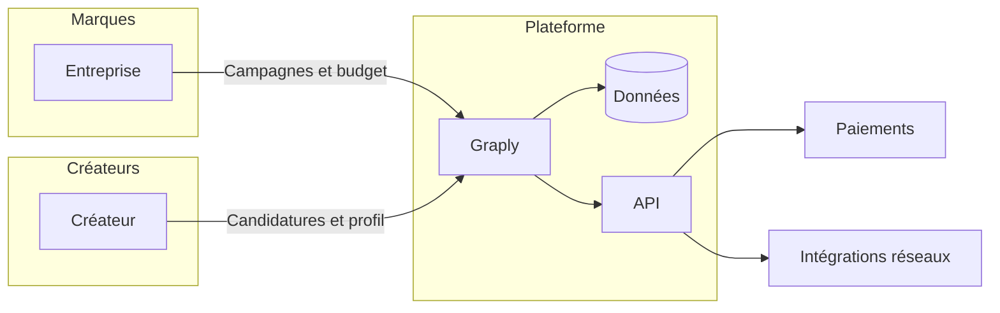

<div align="center">


<br/>

<a href="https://graply.io"></a>


<br/><br/>


<br/>

**Plateforme de mise en relation entre marques et créateurs** — campagnes UGC, candidatures, suivi des contenus et des performances sur les réseaux.

[Site](https://graply.io) · [Dépôt](https://github.com/prodige93/Graply)

</div>

---

> **Projet en développement actif.** L’interface et les parcours métier évoluent.

---

## À quoi sert Graply ?

Graply aide les **marques** à lancer et piloter des **campagnes** avec des **créateurs** (Instagram, TikTok, YouTube), et aide les **créateurs** à **postuler**, suivre leurs **candidatures** et **synchroniser** leurs comptes pour afficher stats et vidéos sur un **dashboard**.

| Côté | Fonctions typiques |
|------|---------------------|
| **Entreprise** | Création de campagnes, budget, validation de contenus, paiements, suivi |
| **Créateur** | Profil, candidatures, messagerie liée aux campagnes, connexion des réseaux (OAuth), vidéos et indicateurs |
| **Technique** | Auth, base de données avec politiques d’accès, API (webhooks, paiements), services optionnels de suivi |

### Schéma simplifié du flux



---

## Stack technique

<p align="center">
  
  
  
  
  
  
</p>

---

## Sommaire

- [Installation](#installation)
- [Variables d’environnement](#variables-denvironnement)
- [Développement local](#développement-local)
- [Build et déploiement](#build-et-déploiement)
- [Base de données](#base-de-données)

---

## Installation

```bash
git clone https://github.com/prodige93/Graply.git
cd Graply
npm install
npm run backend:install
```

---

## Variables d’environnement

Les fichiers d’environnement **ne sont pas versionnés**. Chaque environnement (local, CI, hébergeur) doit être configuré avec les identifiants et URL fournis par les services que vous connectez (hébergement, base de données, paiements, réseaux sociaux, etc.), **sans jamais** coller de secrets dans le dépôt ni dans une issue publique.

---

## Développement local

| Commande | Rôle |
|----------|------|
| `npm run dev` | Front Vite (port par défaut du tooling) |
| `npm run backend:dev` | API Express (proxy `/api` depuis Vite selon config) |
| `npm run lint` / `npm run typecheck` | Qualité du code |

---

## Build et déploiement

```bash
npm run build
```

Le front est émis dans **`dist/`**. La configuration d’hébergement (fichiers du dépôt et variables de build) doit pointer vers une API accessible en HTTPS si vous utilisez le proxy d’API côté front.

---

## Base de données

Les migrations SQL se trouvent dans **`supabase/migrations/`**. Appliquez-les avec l’outil de votre choix (CLI du fournisseur ou interface du service).
