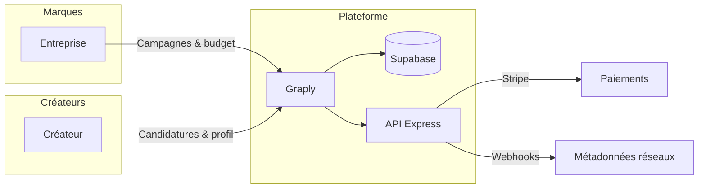

<div align="center">


<br/>

<a href="https://graply.io"></a>


<br/><br/>


<br/>

**Plateforme de mise en relation entre marques et créateurs** — campagnes UGC, candidatures, suivi des contenus et des performances sur les réseaux.

[Site](https://graply.io) · [Dépôt](https://github.com/prodige93/Graply)

</div>

---

> **Projet en développement actif.** L’interface, les intégrations (Stripe, Meta / Instagram, TikTok, YouTube) et les parcours métier évoluent. L’URL publique **graply.io** peut pointer vers une préproduction ou une page d’hébergement selon la phase de déploiement.

---

## À quoi sert Graply ?

Graply aide les **marques** à lancer et piloter des **campagnes** avec des **créateurs** (Instagram, TikTok, YouTube), et aide les **créateurs** à **postuler**, suivre leurs **candidatures** et **synchroniser** leurs comptes pour afficher stats et vidéos sur un **dashboard**.

| Côté | Fonctions typiques |
|------|---------------------|
| **Entreprise** | Création de campagnes, budget, validation de contenus, checkout (Stripe), suivi |
| **Créateur** | Profil, candidatures, messagerie liée aux campagnes, connexion des réseaux (OAuth), vidéos & indicateurs |
| **Technique** | Auth Supabase, RLS, API Express (webhooks, paiements), optionnel service UGC de suivi |

### Schéma simplifié du flux



---

## Aperçu visuel

Les captures d’écran **live** dépendent de l’environnement déployé. Tu peux :

1. Ouvrir **[graply.io](https://graply.io)** (ou l’URL de préproduction) une fois l’app servie.
2. Ajouter des captures dans **`.github/assets/screenshots/`** et les référencer ici, par ex. :
   ``

En attendant, le dépôt inclut une **bannière vectorielle** (`.github/assets/readme-hero.svg`) et l’**icône** applicative (`public/graply-app-icon.jpg`) pour un rendu soigné sur la page GitHub du dépôt.

---

## Stack technique

<p align="center">
  
  
  
  
  
  
</p>

---

## Sommaire

- [Installation](#installation)
- [Variables d’environnement](#variables-denvironnement)
- [Développement local](#développement-local)
- [Build & déploiement (Netlify)](#build--déploiement-netlify)
- [Base de données (Supabase)](#base-de-données-supabase)
- [Sécurité](#sécurité)

---

## Installation

```bash
git clone https://github.com/prodige93/Graply.git
cd Graply
npm install
npm run backend:install
```

---

## Variables d’environnement

Les **`.env`** ne sont pas versionnés. Liste des clés attendues : **`ENV_SETUP.txt`**.  
Secrets OAuth Instagram côté base : **Vault Supabase** (voir migrations associées).

---

## Développement local

| Commande | Rôle |
|----------|------|
| `npm run dev` | Front Vite → [http://localhost:5173](http://localhost:5173) |
| `npm run backend:dev` | API Express → port **3300** (proxy `/api` depuis Vite) |
| `npm run lint` / `npm run typecheck` | Qualité du code |

---

## Build & déploiement (Netlify)

```bash
npm run build
```

- Publication du dossier **`dist/`** (`netlify.toml`).
- Variable **`BACKEND_PUBLIC_URL`** (build Netlify) : URL HTTPS du backend **sans** slash final — utilisée pour le proxy **`/api/*`** (`scripts/patch-netlify-redirects.mjs`). Défaut documenté : `https://api.graply.io`.

---

## Base de données (Supabase)

Migrations dans **`supabase/migrations/`** : schéma, RLS, RPC, stockage, OAuth, etc.  
Lier le projet avec la **CLI Supabase** ou appliquer les scripts depuis le dashboard.

---

## Sécurité

Ne pas committer de `.env`, clés, jetons ni fichiers **`*.vault.local.sql`**. Voir **`.gitignore`**.

---

## Licence

Projet **privé** — droits réservés.
